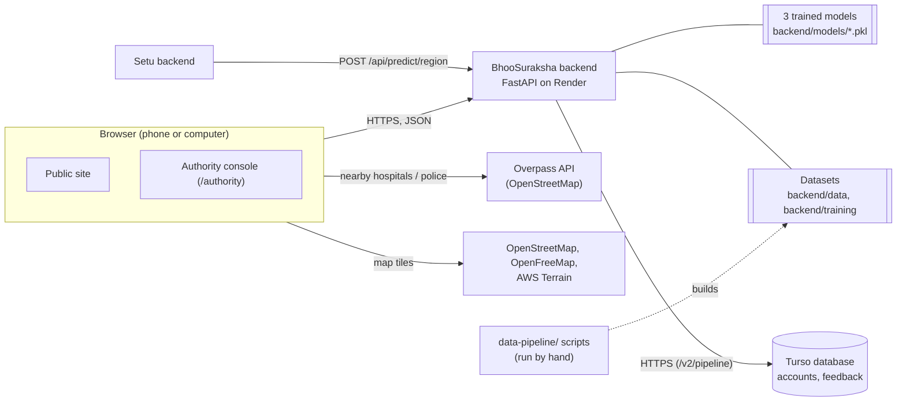

# 2. Architecture

## The parts



| Part | What it is | Where it runs |
|---|---|---|
| Website | React 19 + TypeScript single-page app (Vite 6, Tailwind 4, Leaflet, MapLibre GL) | Vercel |
| Backend | FastAPI, Python 3.12, scikit-learn models loaded at startup | Render (free web service) |
| Models | Three pickled RandomForest classifiers (~15 MB) | Inside the backend |
| Datasets | Training data, elevation grid, Dima Hasao road network (~13 MB) | Inside the backend |
| Database | Turso in production, local SQLite in development: officer accounts and feedback | Turso cloud / your computer |
| Data pipeline | Python scripts that fetch public data and build road networks | Your computer, run by hand |

## How the pieces fit

- **Models** are trained offline (`backend/training/train_*.py`, or the
  original NER pipeline) and saved to `backend/models/`. The backend only
  loads and runs them; it never trains.
- **Zones and alerts:** on first use, `zones.py` scores the 17 NER monitoring
  points with the NER model, using the latest row for each point in
  `data/training_dataset.csv`, and caches the result in memory. `/api/zones`,
  `/api/alerts` and `/api/analytics` all read from that cache.
- **Predictions on request:** `/api/predict` (NER model, rainfall + slope you
  enter), `/api/predict/india`, `/api/predict/region` (location + date).
- **Accounts and feedback** are the only things written at runtime, so they
  are the only things in the database.
- **The website works without the backend:** if no backend address is
  configured, or it can't be reached, it falls back to built-in sample data
  (see [Frontend](08-frontend.md#sample-data-fallback)).

## How Setu uses BhooSuraksha

Setu's backend calls:

```
POST /api/predict/region
{"latitude": 25.17, "longitude": 93.02, "date": "2026-10-07"}
```

and shows the answer's `risk_level`, `probability` and `explanation` as
"landslide risk today" for a district, and uses it to raise or lower the
credibility of landslide reports. Setu caches answers per place per day,
stops calling for 2 minutes after a failure, and pings `/health` when it
starts so a sleeping BhooSuraksha begins waking. This is server-to-server, so
BhooSuraksha's CORS setting doesn't affect it.

## The wake-up call

Render's free plan sleeps after 15 minutes without traffic. Every page pings
`GET /health` when it opens (`frontend/src/utils/serverWake.ts`); after 3 s a
notice says *"Waking up the server…"*, and API calls wait for the ping instead
of failing. After 90 s the notice says the server can't be reached (and the
site uses sample data). There is no keep-alive timer, on purpose (free monthly
hours).

## Performance

Measured on Python 3.12: about **310 MB** of memory with all three models
loaded (Render free limit: 512 MB) and about 7 s to start on a normal
computer (longer on Render's 0.1 CPU).

## Repository layout

```
BhooSuraksha/
├── backend/
│   ├── app.py               FastAPI app: endpoints, CORS, startup checks
│   ├── auth.py              accounts, bcrypt, JWT; Turso or SQLite
│   ├── create_admin.py      create an officer account / reset a password
│   ├── turso_http.py        minimal Turso client over HTTPS
│   ├── feedback.py          public feedback storage + rate limit
│   ├── model.py             Model 1: NER rainfall + slope
│   ├── india_model.py       Model 2: India-wide
│   ├── region_model.py      Model 3: India + Himalayan neighbours
│   ├── zones.py             scores the 17 monitoring points
│   ├── metrics.py           hold-out metrics for the NER model
│   ├── logistics.py         Dima Hasao road routing (networkx)
│   ├── alerts_dispatch.py   SMS/push integration code (not connected)
│   ├── schemas.py           request/response models
│   ├── models/              trained .pkl files + metrics JSON
│   ├── data/                training_dataset.csv, elevation_grid.csv, networks/dima_hasao/
│   ├── training/            training scripts + NASA catalogue CSVs
│   └── requirements.txt     pinned (scikit-learn 1.8.0!)
├── frontend/                React app (see Frontend)
├── data-pipeline/           fetch + build scripts (see Data)
├── docs/                    this documentation
├── render.yaml              Render Blueprint for the backend
└── .python-version          3.12
```
